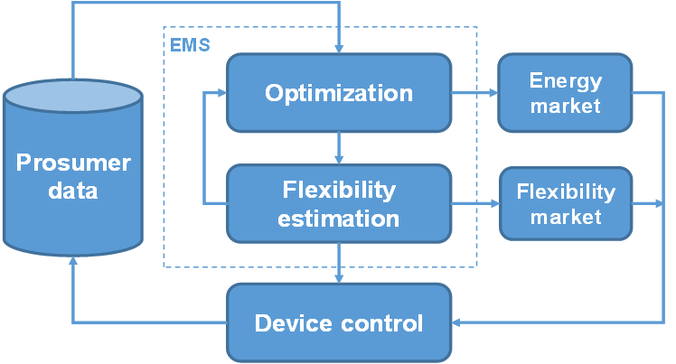

##############################
Modelling prosumer flexibility
##############################

This chapter details about the concept of flexibility and how prosumer can get involved with Local Flexibility Markets (LEMs) by quantifying and pricing their device flexibility using OpenTUMFlex. Following are the important terminologies used with understanding the concept of prosumer flexibility.

**********
Background
**********
The increasing share of renewable energy requires alternative methods to provide power system ancillary services to ensure a stable operation of the electricity grids. Recent research has inclined their interests towards the aggregation of small-scale system flexibility potentials to accommodate grid variations. The advancements towards local flexibility markets allow prosumers participation in solving grid congestion problems. In order to allow prosumers to interact with the LFMs and submit their bids, a flexibility model is required. 

.. figure:: images/Background.png
   :width: 600

******
Design
******
This research proposes an open-source flexibility estimation model that quantifies all possible flexibilities from the available prosumer devices and prices them. The ideology is utilize an energy management system (EMS) which usually evaluate optimal operation plan such load scheduling and add additional feature to it to compute device flexibilies. This allows the EMS to interact with energy markets for its day to day operation and as well allows prosumer to offer flexibility services to the LFMs. 

***********
Flexibility
***********
Flexibility is computed as a measure of quantifying the amount of deviation from the optimal operation of a device. For example, the following figure shows an abstract representation of a device flexibility. Considering the red line to be the optimal operation of a device then the blue region defines the possible deviation the device can undergo during any specific time without deviating from its device properties.

For example, lets suppose a PV system is generating 3kW of power between 12:00 and 12:15 in an optimal operating condition, then the maximum negative flexibility of PV system -3kW by curtailing the feed-in power. 

.. figure:: images/flexibility.png
   :width: 600

*************
Terminologies
*************
    
*Prosumer*
 | An electricity customer who can actively influence their generation or demand pattern

*Flexibility*
 | Flexibility comprises of the measures that influence the generation and/or consumption of the electricity in response to an external signal (price signal).

*Positive flexibility* 
 | Flexibility measures that results in net addition of power to the grid.

*Negative flexibility* 
 | Flexibility measures that results in net removal of power from the grid or curtailment of scheduled grid feed-in.

*Local Energy Markets*
 | Local energy markets are local exchanges that try to balance generation and demand close to real time. 

*************
Abbreviations
*************

:BSS: Battery Storage System
:CHP: Combined Heat and Power system
:DSO: Distribution System Operator
:EV: Electric Vehicle
:HEMS: Home Energy Management Systems
:HP: Heatpump 
:HS: Heat Storage
:LEM: Local Energy Market
:LFM: Local Flexibility Market
:MILP: Mixed Integer Linear Programming
:PV: Phovoltaic system
