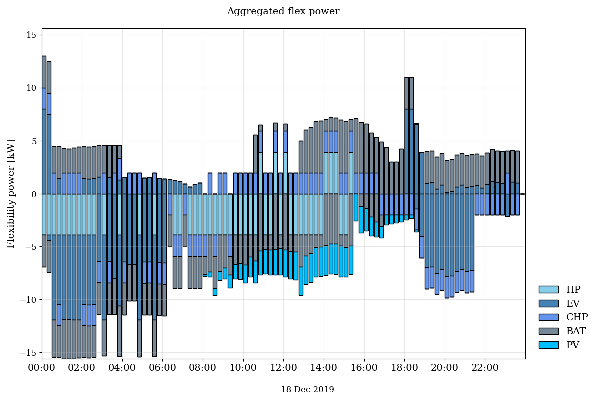
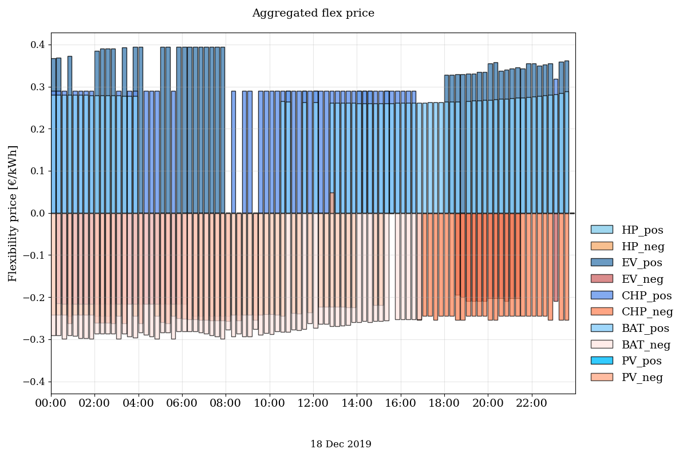

Getting started with OpenTUMFlex
################################

OpenTUMFlex is an open-source flexibility estimation model that quantifies all possible flexibilities from the available prosumer devices and prices them. 

To test and execute your OpenTUMFlex model, this chapter explains about the Python installation procedure and enabling virtual environments.

************
Installation
************

OpenTUMFlex is an open-source model developed using Python programming language and uses additional packages such as Pyomo, Matplotlib, etc., to enable its functioning.  This section explains the step-by-step procedure to install Python IDE and run your first OpenTUMFlex example. 

**Python IDE** |br| 
To use Python programming language you require an integrated development environment (IDE). We recommend you to use one of the following IDEs to run OpenTUMFlex.

* `Pycharm`_ 2020 or later: Community or Professional edition 
* `Spyder`_ 4 or later: Miniconda or Anaconda version
	
**Solver** |br|
To enable Mixed Integer Linear Programming (MILP) optimization, OpenTUMFlex can use GLPK, CPLEX, Gurobi or any other MILP solvers which are supported by Pyomo. By default, the OpenTUMFlex optimization runs using GLPK.

* *Installing GLPK*
	#. Go to GNU Linear Programming Kit (`GLPK`_) website.
	#. Copy the pip command and run it using Anaconda or command prompt. 
	#. In case you have any trouble in your installation, the following video can help you.

	.. raw:: html
	   
	    <iframe width="560" height="315" src="https://www.youtube.com/embed/wcGr0hxmEX0" title="YouTube video player" frameborder="0" allow="accelerometer; autoplay; clipboard-write; encrypted-media; gyroscope; picture-in-picture" allowfullscreen></iframe>	

* *Installing Gurobi (for students and researchers)* 
	#. Go to `Gurobi`_ website and create an account with your university email.
	#. When the account has been activated, log in and download the newest Gurobi solver.
	#. Go to Academia->Academic Program and Licenses
	#. Follow the installation instructions under “Individual Academic Licenses” to activate your copy of Gurobi
	
**Clone repository** |br|
You may use anyone of the following methods to clone the OpenTUMFlex repository to your local drive. 

* Directly `download`_ to a local directory of your choice. 
* Use version control tools such as GitHub Desktop, Sourcetree, GitKraken, etc. 
* Use pure Git link ``git clone https://github.com/tum-ewk/OpenTUMFlex.git``

*******************
Virtual environment
*******************

To install all the required packages, the easiest way is to use a virtual environment.   

**Pycharm** - Python 3.9.

#. Create the virtual environment: ``open "Anaconda Prompt" -> conda env create -f environment_v1.0.yml``
#. Activate the virtual environment:

   * In the command prompt type conda activate OpenTUMFlex
   * Go to Project interpreter 
     ``File->Settings->Project->Python Interpreter`` 
   * Now add an environment 
     ``Add->Conda Environment->Existing environment->Select folder->OK`` 
 

**Spyder** - Python 3.7

#. Create the virtual environment: ``open "Anaconda Prompt" -> conda env create -f environment_v1.0_py37.yml``
#. Activate the virtual environment:

   * In the command prompt type conda activate OpenTUMFlex_py37
   * A new Spyder IDE application will be installed and can be found in the start menu.

.. note::
	Spyder while writing this documentation doesn't support Python 3.9 which is originally used in our enviroment file, we have added an additional enviroment file to support Python 3.7 for Spyder IDE.

**********************
Test your installation
**********************

Run the example.py file to test if the OpenTUMFlex model is correctly installed. If the installation was succesful, you will see the following results:

.. image:: images/energy_balance.png
   :width: 1000

**Figure 1: Electrical and heat load balance**

**Figure 2: Aggregated flexibility for all the devices**

**Figure 3: Aggregated flexibility price**

.. Hyperlinks
.. _Pycharm: https://www.jetbrains.com/pycharm/
.. _Spyder: https://www.spyder-ide.org/
.. _GLPK: https://pypi.org/project/glpk/
.. _Gurobi: https://www.gurobi.com/
.. _download: https://github.com/tum-ewk/OpenTUMFlex/archive/refs/heads/master.zip

.. Line breaks HTML code
.. |br| raw:: html

       
