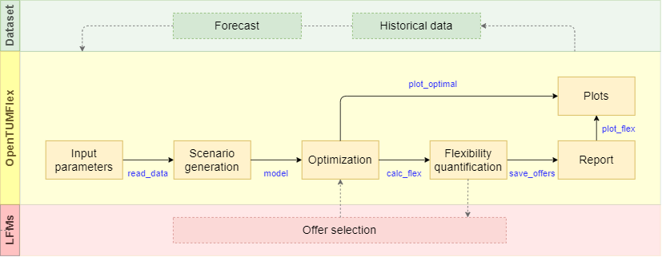

##################
Module description
##################

In this chapter we will disucss the OpenTUMFlex model structure and explanations about how each python files are designed and their respective arguments to control or access different parameters. 

****************
Workflow diagram
****************

****************
File description
****************

*example.py* |br|
Used as an example main file as well as user interface to control different settings and run a specific scenario.

*run_scenario.py* |br|
Secondary to the main file and executes all the functional modules within opentumflex folder including initialization, optimization, flexibility calculation, result generation and plotting.

*scenarios.py* |br|
Create and/or use diverse scenarios for executing a specific set of devices using OpenTUMFlex. 

*set_time.py* |br|
Initialize and configure the time settings and device configuration for the simulation.

*init_ems.py* |br|
Initialize and save ems dictionary object. It also includes the functions for reading forecasting data and device parameters. It contains all the information including devices parameters, optimal operational plan and flexibility for a better overview and user interaction.

*devices.py* |br|
Initialize device parameters with default or customized values or save input data to a local file.

*model.py* |br|
Create and solve Pyomo based MILP models.

*report.py* |br|
Save the MILP optimization results in given path.

*flex_pv.py* |br|
Flexibiltiy quantification and pricing for photovoltic devices.

*flex_bat.py* |br|
Flexibiltiy quantification and pricing for battery storage systems.

*flex_ev.py* |br|
Flexibiltiy quantification and pricing for electric vehicles.

*flex_hp.py* |br|
Flexibiltiy quantification and pricing for heatpumps.

*flex_chp.py* |br|
Flexibiltiy quantification and pricing for combined heat and power devices.

*plot_optimal_results.py* |br|
Plot MILP optimization results as electricity and heat balance.

*plot_flex.py* |br|
Visualize the flexibility quantification and pricing results of OpenTUMFlex for each device individually.

*plot_stacked_flex.py* |br| 
Visualize the flexibility quantification result of all the devices in one stacked plot or bar plot. Also plots aggreagated flexibility bid price plots.

*plot_flex_reoptimized.py* (Yet to be implemented completely) |br|
Visualize reoptimized flexibiltiy results once an offer gets selected. 

*generate_market_offers.py* |br|
Save flexibility offers in .xlsx/.csv format

*******************
Important arguments
*******************

**Plotting results** |br|
Change the arguments to enable/disable each plot:

* ``show_opt_res``: plot the optimization results (energy balance and device SoCs)
* ``show_flex_res``: plot the flexibility result table of all available devices individually
* ``show_aggregated_flex``: plot the cumulative flexibility power and price of all the available devices

**Saving results** |br|
Save the values of the optimization results and devices flexibility results.

* ``save_opt_res``: save the optimization results in a spreedsheet 
* ``save_opt_res``: save flexibility result of all the devices 
* ``market``: choose between Comax/ALF LFM formats for the result file

.. Line breaks HTML code
.. |br| raw:: html

       