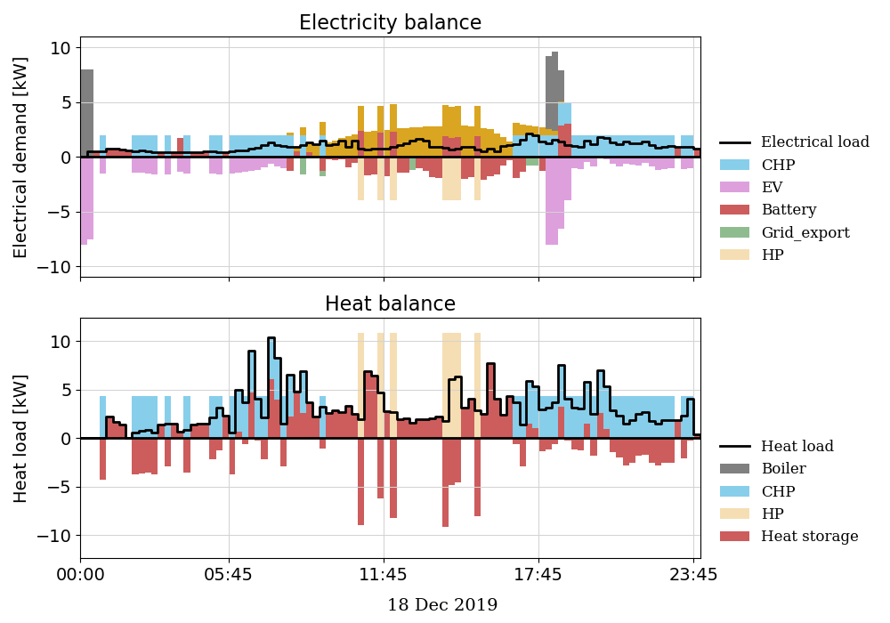
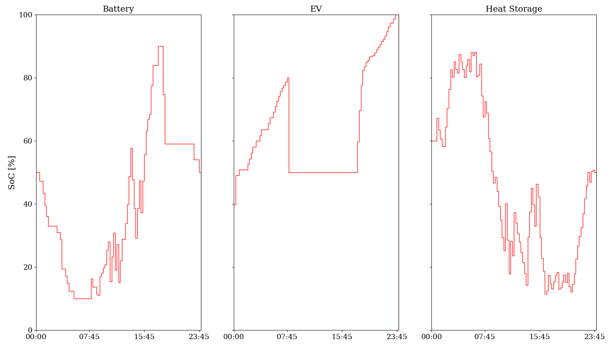
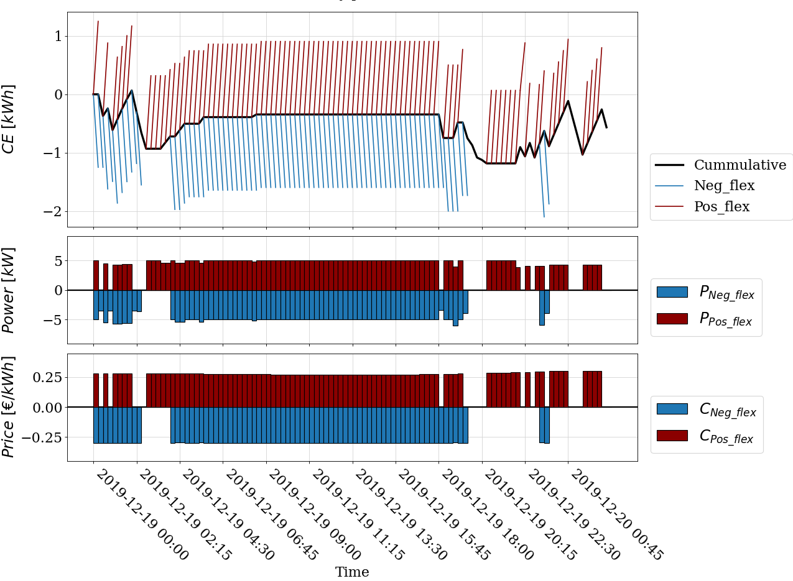

#################
Analysing results
#################

**************
Energy balance
**************

* Upper subplot shows the electricity balance and lower subplot for heat balance
* Bars in positive direction indicate the supply of commodities 
* Bars in negative direction mean consumption
* Colors of bars indicate different household devices.
* Thick black line represents the electrical/heat load

***************
State of charge
***************
State of Charge of the following devices are shown here as combined subplots.

* Battery storage system (BSS)
* Electric vehicle (EV)
* Heat storage system (HSS)

******************
Device flexibility
******************
To understand device flexibility one specific device is discussed here. The following section discusses about the flexibility of a battery storage system.

**Battery Flexibility**

* Upper subplot shows the cumulative energy (electricity) consumption/generation[kWh]
* Lower subplot for flexibility power and prices
* Black line represents the cumulative energy consumption/generation [kWh] in the optimal schedule.
* Red lines mean positive flexibility, while blue lines indicate negative flexibility.
* Color of flexibility power and price corresponds with the upper subplot

