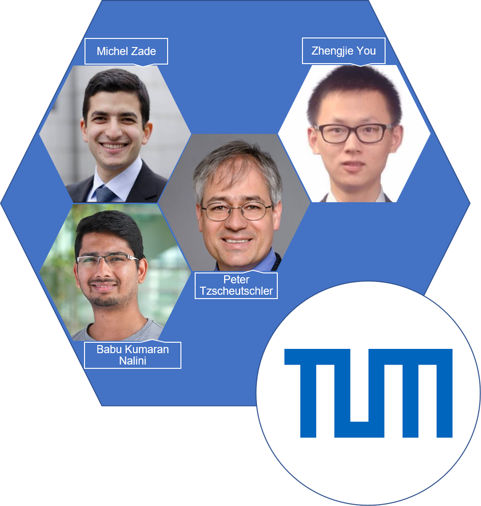

################
Getting involved
################
Write to us for a quick chat! 

Our team: `Babu Kumaran Nalini`_, `Zhengjie You`_, `Michel Zadé`_, `Peter Tzscheutschler`_

***************
Project funding
***************
OpenTUMFlex was funded by the `C/sells`_ project. C/sells is one of five show cases of the research program Smart Energy Showcases – Digital Agenda for Energy Transition (`SINTEG`_) sponsored by the German Federal Ministry of Economics and Technology. 

.. _Babu Kumaran Nalini: https://www.ei.tum.de/en/ewk/personen/wissenschaftlich/babu-kumaran/
.. _Zhengjie You: https://www.ei.tum.de/en/ewk/staff/scientific-staff/zhengjie-you/
.. _Michel Zadé: https://www.ei.tum.de/en/ewk/personen/wissenschaftlich/michel-zade/
.. _Peter Tzscheutschler: https://www.ei.tum.de/en/ewk/personen/leitung/peter-tzscheutschler/
.. _C/sells: https://csells.net/en/
.. _SINTEG: https://www.sinteg.de/en/